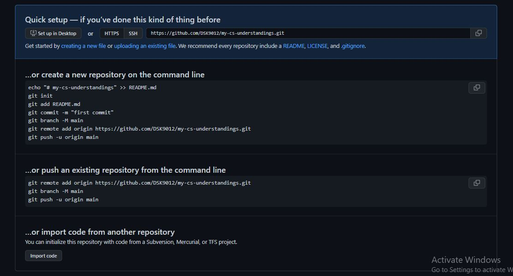

# Git Commands

|Command|Description|
|-|-|
|**BASIC COMMANDS**|
|git --version      |Check the version of git installed|
|git update-git-for-windows  |Update git for windows|
|git init    |Initialize the git in working directory|
|git status |Check working directory and staging area status|
|git ls-files |List files in staging area|
|git log |Display all commits of current branch in detailed view|
|git log --oneline |Display all commits of current branch in short view|
|git branch |Check current branch|
|**COMMIT CHANGES**|
|git add file1 file2|Add file changes to staging area|
|git add . |Add all changes to staging area|
|git commit -m "your_message" |Commit your changes in staging area|
|**BRANCH CREATION AND DELETION**|
|git branch branch_name |Create a new branch|
|git branch -d branch1 branch2|Delete branch if it is merged with any other branch|
|git branch -D branch_name|Force delete the branch|
|git checkout branch_name or git switch branch_name|Switch to specific branch|
|git checkout -b branch_name or git switch -c branch_name |Create and switch to new branch|
|git merge other_name |Bring other branch changes to current branch|
|**DETACHED MODE**|
|git checkout commit_id or git switch --detach commit_id |Switch to a specific commit in detached mode|
|git branch branch_name detached_mode_commit_id |Place detached mode changes in new branch to merge with others|
|**UNDO WD CHANGES**|
|git restore file_name or git restore . or git checkout file_name or git checkout .|Undo unstaged tracked file changes in WD. Changes will be removed.|
|git rm file_name |Remove file from staging area|
|git clean -dn |Show what are the newly created files will be deleted in WD|
|git clean -df |Force delete the new files in WD|
|**UNDO STAGED CHANGES**|
|git restore --staged file_name or git restore --staged . or git reset file_name or git reset .|Undo the changes from staging area, but changes wont be removed from WD|
|**UNDO COMMITS**|
|git reset HEAD~1|Go back to previous commit and undo the changes from staging area|
|git reset --soft HEAD~1|Go back to previous commit and keep the changes in staging area|
|git reset --hard HEAD~1|Go back to previous commit and remove changes in WD|
|**STASH CHANGES**|
|git stash|Remove and store the changes of tracked files in a seprate memory, available for 30 days.|
|git stash push -m <stash_name>|Stash changes with a message|
|git stash list|List all the stash changes|
|git stash apply or git stash apply <stash_index>|It will restore those changes to WD|
|git stash pop or git stash pop <stash_index>|It will restore those changes and remove the stash|
|git stash drop or git stash drop <stash_index>|It will remove the stash in memory|
|git stash clear|It will remove all stored stashes from memory|
|**REFLOG (BRING BACK DELETED COMMITS OR BRANCH CHANGES)**|
|git reflog|It will display all the commits in all branches like a log.|
|git reset --hard <deleted_commit_id_from_reflog_log>|It will move the HEAD to last deleted commit.|
|git checkout <deleted_branch_commit_id_from_reflog_log>|It will create a detached-HEAD mode as usua.l|
|**MERGING**|
|git merge <branch_name>|It will pull the commits from other branch to existing|
|git merge --abort|It will abort merging when there are conflicts.|
|git diff|It will show us the conflicting changes|
|git log --merge|It will log the file details which are causing conflicts.|
|**FAST-FORWARD MERGING**|
|git merge <branch_name>|FF merging occurs by default when there is no new commits in master branch(from the one we are running this merge command) after switched to a new feature branch, i.e It will just move the new feature branch commits to master branch on top of master branch old commits.(Indirectly it will just move the master HEAD to latest commit)|
|git merge --squash <branch_name>|Following the FF merge, It won't just move all new commits directly, instead it will combine all new commits in feature branch and move those combined changes to staged area in master branch, afterwards we can commit them as a single commit on top of master old commits|
|git merge --no-ff <branch_name>|We can explictly override FF merging with --no-ff flag to follow recursive or non FF merging strategy. It will move new feature branch commits to master and in addition it will create a new commit on top of latest commit from feature branch in master branch which is not recommended in my perspective.|
|**NON-FAST-FORWARD MERGING(RECURSIVE)**|
|git merge <branch_name>|Non-FF merging occurs by default when there are some new commits in master branch(from the one we are running this merge command) after switched to a new feature branch. i.e It will move all the new commits from feature branch to master branch and its order is based on the time commits got created. In addition to these it wil create a new commit on top of all latest commits combining both branches.|
|git merge --squash <branch_name>|Following the Non-FF merging, It won't directly move new commits of feature branch to master, instead it will combine all new commits from feature branch and move those combined changes to staging area of master branch. Afterwards we can commit the changes as usual and this commit will get created on top of the latest commits created in master branch.|
|**REBASING**|
|git rebase <branch_name>|Its kinda of merging only. Rebasing a master branch will make its latest commit as the base commit in feature branch and on top of it, rebasing will re-write the new commits with new commit IDs of feature branch. So when we merge master with feature, the merging will be FF merge.|
|git rebase --abort|It will abort the rebasing when there are conflicts.|
|git rebase --skip|It will skip the feature branch commits if the commit is causing conflicts.|
|git rebase --continue|After resolving conflicts, we need to continue rebasing so that it will merge changes to feature branch without a new merge commit.|
|**CHERYY_PICKING**|
|git cherry-pick <commit_id>|It will pick any branch specific commit id and bring it to current branch.It will copy that commit with new ID.|
|**TAGS (LIGHTWEIGHT AND ANNOTATED)**|
|git tag <tag_name> -m "<message>" or git tag <tag_name> -m "<message>" <commit_id>|Tags usefull when we want identify specific commit as a milestone. It will create a lightweight(A tag with basic commit info only.) tag. It will create a tag for the latest commit if we don't provide commit id.|
|git tag|List all the tags available.|
|git show <tag_name>|It will show us the commit details.|
|git tag -a <tag_name> -m "<message>" <commit_id>|It will create annotated tag with more info like created user etc. Typically we use this most.|
|git tag -d <tag_name>|It will delete the tag.|

# Remote Repo Commands (Flow: local_branch/local_tracking_branch---->remote_tracking_branch---->remote_branch)
|Command|Description|
|-|-|
|**Basic Commands**|
|git branch -M <new_branch_name>|It will rename the current_branch name.|
|git clone <remote_repo_URL>|Clone the remote repo into local disk.|
|git clone <remote_repo_URL> .|Clone the remote repo into local disk without creating a seprate subfolder.|
|git branch|List all local branches.|
|git branch -a|List all local and remote branches, which includes local, local tracking and remote tracking branches only.|
|git branch -r|List all remote tracking branches only.|
|git ls-remote|List all remote origin branches only.|
|git branch -vv|List all local and local tracking branches only. Here we can find the what are local and local tracking branches.|
|git remote|Show the remote origin name.|
|git remote show <origin_name>|List all the details about remote origin. Here origin_name can be anything, but we mostly use origin.|
|git remote add <origin_name> <remote_repo_URL>|Add the remote(GitHub) repo into the local repo to create a connection. Again, origin_name can be anything, but we mostly use origin.|
|git fetch / git fetch <origin_name>|It will fetch all the newly created remote_branches and their changes. And It will create a remote_tracking_branches for them.|
|git fetch <origin_name> <branch_name>|It will fetch only the mentioned branch changes into remote_tracking_branch.|
|**Pushing/Pulling** (For local branch and local tracking branches)|
|git push <origin_name> <remote_branch_name>|For local branch without setting upstream, when we want to push our changes to remote branch, we should provide both origin_name and remote_branch_name explicitly.|
|git pull <origin_name> <remote_branch_name>|For local branch without setting upstream, when we want to pull our changes from remote branch, we should provide both origin_name and remote_branch_name explicitly. Everytime git pull performs two commands internlly, which are git fetch and git merge, fetching the changes from remote_repo and merging them into current_branch repectively.|
|git pull --rebase <origin_name> <branch_name>|It will merge your code following FF merge explicitly. But before running this, you have to make sure your local branch is updated with its origin, or else the old commits from main branch will appear as new ones in your PR. It should be handled CAREFULLY. After rebasing successfully, sometimes you need to push changes forcefully since rebasing will make all main branch commits as base commits in feature branch.|
|git push -f/--force <origin_name> <branch_name>|It will forcefully push the changes.|
|git branch --track <remote_branch_name> <remote_tracking_branch_name>|Create a local tracking branch manually, which is a local copy of remote_tracking_branch and directly linked to it. Here when pulling and pushing the code, we don't need to mention the origin_name and remote_branch_name explicitly.|
|**Upstream**|
|git push/pull -u/-set-upstream <origin_name> <remote_branch_name>|Upstream is nothing about creation of local_tracking_branch implicitly when pulling/pushing the code. So later onwards, we don't need to mention the origin_name and remote_branch_name explicitly.|
|**Deleting Remote Branches and Commits**|
|git branch --delete --remotes <remote_branch_name>|Delete remote_tracking_branch.|
|git push <origin_name> --delete <remote_branch_name>|It will delete the remote_branch and also the remote_tracking_branch in our disk. You know there is no meaning in keeping the remote_tracking_branch when the remote_branch itself is deleted.|

# Git Quick Setup from GitHub
